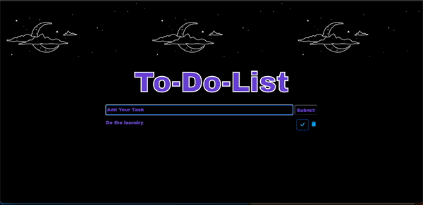

# SQL To-Do-List

## Description
Duration: Weekend Project

The goal of this project was to create a full-stack CRUD app that allows user to create Tasks for a to-do-list. The Tasks created from client are sent to server to be stored in the local database. The Tasks can be marked as 'Complete' or 'Delete', which will be updated in the database. Additional feature include popups that confirms action of users. 

## Installation
1. Simply download or clone this repository
2. Using provided database.sql file, use a database manager of your choice ([Postico](https://eggerapps.at/postico/)) to create a local database with the listed table name and structure.
3. Run `npm install` in the terminal to install dependencies locally.
4. Run `npm start` in your terminal to start the project's local server.
    - To stop the local server by pressing `ctrl-c`.
    - To stop all instances use `killall -9 node`. 
5. Open a browser window and navigate to [http://localhost:5000/](http://localhost:5000/).

## Screen Shot

### Prerequisites
- [Node.js](https://nodejs.org/en/)
- [PostgreSQL](https://www.postgresql.org/)

## Built With
- Node.js
- PostgresSQL
- jQuery
- Bootstrap/SweetAlert
- HTML/CSS/Javascript 

## Acknowledgement
Thanks to [Prime Digital Academy](www.primeacademy.io) who equipped and helped me to make this application a reality. 

## Support
If you have suggestions or issues, please email me at [nguy2884@umn.edu]